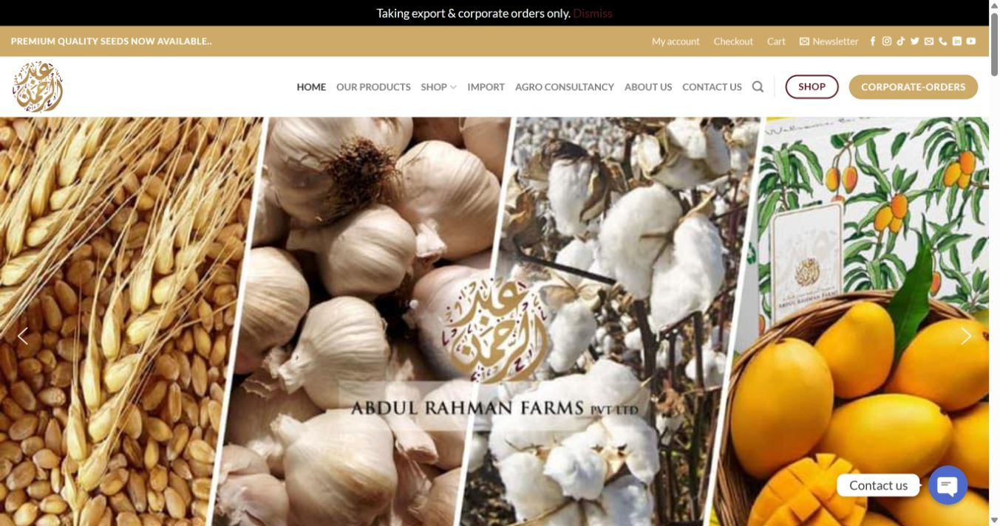
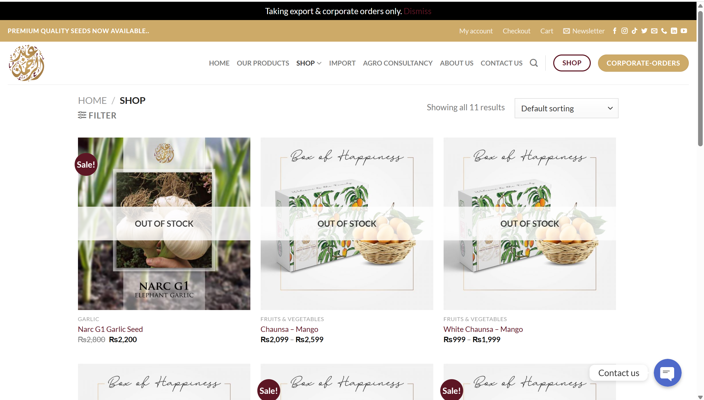
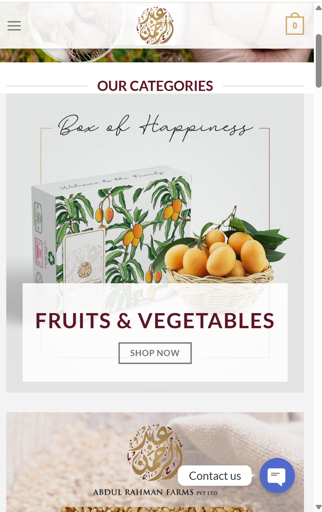

# Abdulrahman Farms — WordPress Website

A complete website design and development project for Abdulrahman Farms, an agricultural business showcasing farm produce, seeds, and services.

**Live website:** https://abdulrahmanfarms.com  
**Platform:** WordPress  
**My role:** Complete Website Design & Development, including banners and visual assets  
**Delivered through:** Trend Got Viral — my company

## Project Overview

The website brings the farm’s products, business information, and services together in one place. Visitors can explore the product catalog, view product details and pricing, and find information about corporate orders and agricultural consultancy.

## My Contribution

I designed and developed the complete website through Trend Got Viral, handling the website layout, page setup, content presentation, and overall implementation. I also designed the website banners and supporting graphics.

## Website Highlights

- Product catalog featuring mangoes, dates, and garlic seeds
- Product pages with pricing and availability information
- Shopping cart, checkout, and customer account pages
- Corporate orders section
- Import and agro consultancy pages
- About and contact pages
- Customer testimonials and farm video content

## Portfolio Note

This folder documents my work on the project. The live website may change as the business updates its products and content.

## Website Screenshots

### Homepage

### Shop

### Mobile view

